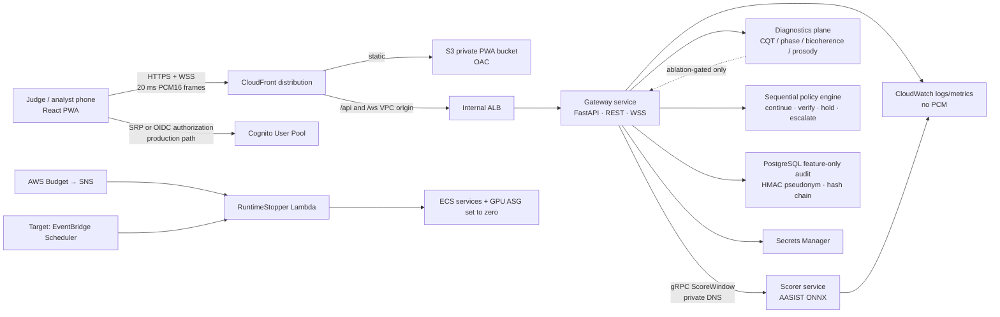

# SIH26104 — Voice Integrity Control Plane

**Document status:** Final team architecture blueprint. **Primary audience:** product, ML, backend, mobile, infrastructure, security, and presentation teams. **Authoritative inputs:** the supplied SIH26104 problem statement; the supplied Expected Outcome and Privacy Layer report; the AWS-first architecture diagram; the AWS reference implementation; and the binding CPU-only fallback specification. Where an input conflicts with validated implementation, this document names the difference and sets the required target decision rather than silently blending them.

> **One-line product definition:** Voice Integrity Control Plane is a privacy-preserving, real-time decision layer that turns persistent evidence of synthetic or manipulated speech into a proportionate verification control before a simulated high-risk voice action is completed.

The product is **not** a universal “deepfake truth machine,” a biometric identity system, or a fraud-reduction claim. The five-day demonstration proves a narrower and defensible result: a consented audio stream can generate a calibrated risk signal, accumulate temporal evidence, and cause a simulated high-risk workflow to hold, verify, or escalate without storing raw audio by default.

## 1. Executive Summary and Constraints

SIH26104 asks for near-real-time detection of cloned or synthetic speech across telephony, VoIP, and collaboration channels; dynamic risk scoring; contextual policy; alerts; reusable APIs; multilingual Indian readiness; and minimal-retention privacy. The architecture therefore separates **detection** from **decision**. The scorer answers “how much evidence of synthetic/manipulated speech is present in this voiced window?” The Gateway answers “given recent evidence, purpose, policy version, and uncertainty, what safe next action is appropriate?” This distinction is the system’s central engineering and judge-facing principle. [1]

The production-shaped deployment is AWS-first in `ap-south-1`, using CloudFront, a private ALB, ECS EC2 GPU capacity, private PostgreSQL, Cognito, ECR, Secrets Manager, and CloudWatch. It is accompanied by a local, CPU-only Compose tier that runs the same application source, protobuf contract, database schema, policy bundle, model artifact, calibration artifact, and contract tests. This makes the local tier a rehearsed continuity path—not an improvised emergency prototype.

| Constraint | Final decision | Acceptance measure | Non-claim |
|---|---|---|---|
| Near-real-time decision | 2.56-second voiced rolling window, 640 ms hop, 20 ms PCM16 frames, first decision after sufficient voiced content | Measure first-decision latency and p95 score-to-action latency on the actual demo path | No carrier-grade SLA is claimed before load and network testing |
| Risk semantics | Calibrated `spoof_risk ∈ [0,1]`, then `collecting`, `uncertain`, or `high` policy state | Three high windows among the five most recent eligible windows activate a high-risk policy action | A score is not proof of fraud, cloned identity, or malicious intent |
| High-risk action | `hold` for payment release/beneficiary change; `verify` for account recovery; `escalate` for support | Simulated workflow rejects release while high-risk state is unresolved | No real money movement, account change, or automated denial |
| Privacy | No raw-audio persistence by default; in-memory rolling window only; HMAC pseudonym; feature-only audit | Database and log scan show no PCM, waveform, transcript, phone number, or embedding | HMAC pseudonymization does not make all metadata anonymous |
| Deployment resilience | AWS tier and local CPU fallback rehearsed before judging | Same 90-second demo and traceability evidence run on both tiers | The two runtime images cannot be byte-identical because CPU/GPU ORT dependencies differ |
| Cost | Paid Plan with verified eligible credits, runtime-off-by-default, one GPU ceiling, manual and automated stops | Runtime count/ASG desired count returns to zero after each session | AWS Budgets are delayed cost controls, not an instantaneous circuit breaker |

## 2. Architecture Diagram: Final Reading and Reconciliation

The supplied diagram is the visual reference for the final system. Read it as four planes: **Edge and Identity**, **Private Inference and Policy**, **Privacy and Data**, and **Security/Observability/Cost**. The data path is deliberately narrow: the phone sends HTTPS/WSS only to the edge; the private Gateway sees audio only transiently; the Scorer returns a numerical result; the audit system retains a feature-level decision record.

The diagram contains three **target additions** that are not yet completely represented by the current reference package. EventBridge Scheduler nightly stop is required by the target architecture; the package currently has Budget → SNS → Lambda stop only. The production topology requires mTLS from Gateway to Scorer; the five-day AWS reference currently relies on VPC isolation plus security groups for gRPC. The diagram shows AudioWorklet PCM capture and Cognito PKCE, while the reference PWA currently uses a `ScriptProcessor` bridge and direct Cognito SRP. Treat those as explicit backlog items, not hidden equivalence claims.

| Diagram element | Final target | Current package position | Required action before calling it production-ready |
|---|---|---|---|
| CloudFront → internal ALB | Single public HTTPS/WSS entry through VPC origin | Implemented; manual binding of the CloudFront service-managed security group is documented | Rehearse WSS reconnect and ALB origin health |
| ECS GPU host | One `g4dn.xlarge`, one scorer GPU allocation, app-private subnet | Implemented with runtime-off default | Confirm quota and actual image/model start on AWS |
| Diagnostics plane | CQT, phase, bicoherence, and prosody as explainability candidates | Not implemented as policy inputs | Add only after ablation establishes robust incremental value; never hard-code frequency-boundary rules as spoof evidence |
| Cognito PKCE | Authorization Code with PKCE for a browser production client | MVP uses direct SRP through Cognito SDK | Either complete PKCE/Hosted UI configuration or present SRP truthfully as the controlled demo path |
| AudioWorklet capture | Dedicated 16 kHz worklet with backpressure and no main-thread audio conversion | MVP contains temporary ScriptProcessor capture | Replace before final mobile reliability claim; test Safari/Android Chromium behavior |
| Scheduler nightly stop | `Asia/Kolkata` EventBridge Scheduler invokes the same RuntimeStopper Lambda | Not yet in CDK | Add a scheduler execution role, `cron(...)`, retry/DLQ policy, and an enabled/disabled deployment parameter |
| Tenant isolation and mTLS | JWT tenant claim, RLS, encryption context, service mTLS | Current MVP schema is single-tenant and gRPC is security-group protected | Implement before multi-tenant or enterprise claim |

## 3. Core Architecture and Infrastructure

### 3.1 Architectural style

The correct style is a **modular, event-aware microservice control plane** with a deliberately small number of deployable units. The Gateway is stateful only for the current in-memory rolling session; it owns ingress validation, VAD, session/purpose binding, risk accumulation, policy, audit writes, and integration notifications. The Scorer is computationally isolated and owns only model loading and window scoring. PostgreSQL owns durable feature-only audit events. The PWA is a thin capture and analyst-control surface. This division keeps the GPU trust boundary small without turning the five-day build into an unfinishable service mesh.

For AWS demo capacity, both services run on a single GPU-capable ECS EC2 host. This is a capacity choice, not a code-level coupling. At scale, Gateway tasks can expand independently on CPU capacity while Scorer tasks expand on GPU capacity. Cloud Map service discovery keeps the gRPC endpoint stable. Amazon ECS supports GPU-aware task placement and specifies `g4dn.xlarge` as one GPU with 16 GiB GPU memory, four vCPUs, and 16 GiB memory. [2]

### 3.2 AWS-first tier

The AWS tier uses a **Paid Plan with verified remaining credits**, not an assertion that a GPU is free. The stack starts with zero desired ECS tasks and zero desired GPU instances. Operators push images and model artifacts, then explicitly deploy with `deployRuntime=true`. The active plane uses a single `g4dn.xlarge`; the control plane uses RDS PostgreSQL `db.t4g.micro`, ECR, Cognito, Secrets Manager, CloudWatch, S3, CloudFront, private VPC subnets, one NAT gateway, and a VPC-origin internal ALB.

CloudFront VPC origins allow a private ALB to remain the origin while CloudFront is the public entry point. CloudFront supports WebSockets when the relevant WebSocket headers are forwarded; VPC origins do not support gRPC, so gRPC remains strictly Gateway-to-Scorer inside the VPC. [3] [4]

| Layer | AWS component | Configuration decision | Why it exists |
|---|---|---|---|
| Edge | CloudFront distribution | S3 default behavior; non-cached `/api/*` and `/ws/*`; HTTPS-only viewer policies | One domain, browser-compatible TLS, PWA asset delivery, WSS entry |
| Static client | Private S3 + Origin Access Control | Bucket public access blocked; CloudFront principal only | Avoids a public website bucket |
| Ingress | Internal ALB via CloudFront VPC origin | TCP 8080 origin path; manual service-managed SG bind after origin creation | No public ALB and no direct task ingress |
| Gateway | ECS EC2 FastAPI service | 0.5 vCPU, 1 GiB; private subnet; no execute command in demo | Validates sessions, frames, policy, and audit only |
| Inference | ECS EC2 scorer service | 2 vCPU, 4 GiB, `gpuCount=1`; CUDA ONNX Runtime | Keeps model process separate and GPU-pinned |
| Service discovery | AWS Cloud Map private DNS | `scorer.sih26104.local:50051` | Removes hard-coded IPs from Gateway |
| Data | RDS PostgreSQL 16 | Private, encrypted, single-AZ, one-day backup, destroy-on-teardown | Feature-only audit and policy versioning |
| Secrets | Secrets Manager | DB password, ticket key, HMAC key, audit-chain key | No credentials in image or PWA |
| Observability | CloudWatch Logs and metrics | One-week demo log retention; no PCM payload logging | Operational evidence without audio capture |
| Cost safety | Budget → SNS → Lambda; target Scheduler → same Lambda | Lambda sets both service counts and ASG min/max/desired to zero | A direct EC2 stop is insufficient because ASG can relaunch it |

### 3.3 CPU-only local fallback tier

The fallback is a **single-host Compose shell**, not a second product. Caddy owns the only exposed host ports and terminates locally trusted TLS; it reverse-proxies API and WSS to Gateway and static files to the PWA. Gateway, Scorer, and PostgreSQL publish no host ports and communicate by Compose DNS. Caddy’s reverse proxy supports WebSocket upgrade to a bidirectional tunnel, but it closes active WebSockets on configuration reload; never reload it during the judge stream and test client reconnect/backoff. [5]

The CPU tier uses `CPUExecutionProvider` and a host-specific ONNX Runtime thread sweep. It may use a separately built image because CPU and GPU ONNX Runtime are distinct runtime dependencies. The non-negotiable parity set is the Git commit, Gateway and Scorer source, protobuf hash, API schema, migration set, policy bundle hash, model ONNX SHA-256, calibration SHA-256, and contract-test suite. The local demo must record all of those hashes in its startup banner and audit metadata.

| Concern | AWS tier | CPU fallback tier | Invariant that judges should see |
|---|---|---|---|
| Browser edge | CloudFront + private S3 | Caddy + local static PWA | Same PWA build hash, API base URL only differs |
| Identity | Cognito | Restricted local JWKS test issuer | Same JWT validation code and group/tenant claim contract; local issuer is explicitly demo-only |
| Gateway | ECS Gateway container | Same Gateway image/application source | Same OpenAPI and WebSocket contract |
| Scorer | CUDA ORT on `g4dn.xlarge` | CPU ORT after p95 thread sweep | Same model and calibration hashes; execution provider differs |
| Audit | RDS PostgreSQL | Named-volume PostgreSQL container | Same schema, hash-chain verifier, and retention worker |
| Secrets | Secrets Manager injection | Docker secrets or protected local `.env` | Same logical key names; no secrets in Git |
| Reachability | Internet through CloudFront | Venue LAN first; temporary tunnel only if rehearsed | Same consent and privacy notice; tunnel is not “offline” |

## 4. Networking, Security, and Privacy & Trust Plane

The system takes a **deny-by-default** approach. Browser traffic reaches CloudFront or Caddy; the browser cannot open the Gateway, Scorer, or database directly. In AWS, the ALB accepts only the CloudFront VPC-origin service-managed group; Gateway accepts only ALB; Scorer accepts only Gateway gRPC; PostgreSQL accepts only Gateway. The database is not public, and no SSH or public IP is placed on the GPU host. In local mode, the analogous control is “only Caddy has published ports.”

The Privacy & Trust Plane is not a sidebar. It is an enforceable contract across session opening, volatile audio handling, storage, alert payloads, and administration. A purpose code is mandatory; the PWA shows a notice before microphone capture; `client_call_ref` is HMAC-pseudonymized before it appears in the WSS session; the ring buffer is cleared on disconnect; default audit storage contains only non-audio decision fields; and an HMAC hash chain exposes event tampering.

| Threat | Enforced control | Test that must exist |
|---|---|---|
| Raw audio appears in a bucket, DB, log, crash dump, or alert | No audio object store; no audio DB columns; redacted structured logging; volatile buffer clear; payload-size guards | Search database schema/log samples; assert raw-byte count is zero |
| Browser submits a replayed or malformed stream | Cognito JWT or restricted local test token, short-lived signed stream ticket, Origin allowlist, monotonic frame sequence, exact 20 ms framing | Negative WSS contract tests for missing ticket, wrong Origin, duplicate sequence, wrong byte length |
| Cross-tenant disclosure | Target: tenant claim, PostgreSQL RLS, tenant-scoped HMAC/encryption context | Integration test gives 403 / zero rows to wrong tenant |
| Overconfident model action | Sequential three-of-five evidence, `uncertain` state, human verification rather than denial | Adversarial noisy/codec sample must not automatically approve or deny |
| Secrets enter source or client | Secrets Manager/Docker secret injection, no client secret, ECR/CI secret scan | CI secret scan and deployment manifest inspection |
| Audit record alteration | HMAC event chain plus periodic signed root checkpoint | Modify one historical record in a test copy; verifier fails deterministically |

NIST frames privacy risk management as a repeatable organizational practice, and OWASP emphasizes authentication and origin validation for WebSocket endpoints. These controls are directly relevant because live voice streaming creates both privacy and session-hijacking risk. [6] [7]

## 5. Exact Technology Stack

| Concern | Final choice | Version/pin policy | Notes |
|---|---|---|---|
| Mobile PWA | React `19.2.8`, React DOM `19.2.8`, Vite `8.2.2` | Lock `pnpm-lock.yaml`; no unpinned production rebuild | Current reference build versions; target moves capture to AudioWorklet |
| Cognito client | `amazon-cognito-identity-js` `6.3.20` | Use direct SRP only for MVP; production browser flow should use Authorization Code + PKCE | SMS disabled; software TOTP supported for configured users |
| Styling | Plain CSS with accessible native controls | Keep bundle lean for a demo PWA | No unnecessary design-system dependency |
| Gateway runtime | Python `3.12`, FastAPI `0.115.6`, Uvicorn `0.34.0`, Pydantic Settings `2.7.1` | Pin package lock/image digest | Async HTTP/WSS application boundary |
| Streaming/audio | `webrtcvad-wheels` `2.0.14`, NumPy `2.1.3`, native AudioWorklet target | 16 kHz mono PCM16 contract | No raw audio files pass through the application data plane |
| Internal RPC | `grpcio`/`grpcio-tools` `1.68.1`, protobuf contract `ScoreWindow` | Protobuf compatibility test on every change | gRPC is internal only |
| DB | PostgreSQL `16`, `asyncpg` `0.30.0` | Versioned migrations, no ad hoc schema changes | SQLAlchemy/Alembic are recommended target additions for formal migration governance |
| ML training | PyTorch matching AASIST reference, torchaudio, librosa only for offline diagnostics | Lock conda/uv environment and CUDA version | Training and inference environments are separate, reproducible artifacts |
| ML serving | AWS `onnxruntime-gpu` `1.20.1`; local `onnxruntime` CPU build | Pin CUDA/cuDNN/ORT compatibility and model hash | Verify provider availability and output parity at startup [8] |
| Edge/local proxy | Caddy 2, mkcert for rehearsed local trust | Pin Caddy image digest for demo | LAN first; tunnel only if intentionally tested |
| Infrastructure | AWS CDK TypeScript `2.266.0`, Docker Buildx, ECR | Synth and policy scan before deploy | CDK is the source of truth; no console drift except documented VPC-origin SG bind |
| Observability | CloudWatch structured logs; target OpenTelemetry metrics/traces | Metric schema versioned in code | No PCM, transcript, or direct identity in attributes |

## 6. Data Flow and Core System Design

### 6.1 Primary high-risk action lifecycle

The analyst signs in and selects a consented demonstration context such as `payment_release`. Before microphone access, the PWA displays a purpose-and-privacy notice. The PWA sends the human-readable demo call reference only to `POST /api/v1/sessions`; Gateway immediately computes a server-keyed HMAC and returns `session_id` plus opaque `call_ref`. The browser then requests a short-lived stream ticket using the Cognito ID token and opens `wss://<edge>/ws/v1/stream` with `sih-v1` and the ticket subprotocol.

The first WSS message is `SessionOpen`, containing only opaque `call_ref`, `purpose_code`, and `context_value_band`. Every following binary frame has an unsigned 64-bit big-endian sequence prefix and 640 bytes of 16 kHz, 16-bit mono PCM—the exact 20 ms frame contract. Gateway rejects non-monotonic, malformed, over-sized, unauthenticated, or cross-origin traffic. It chunks through VAD, retains only voiced samples in a rolling 2.56-second in-process buffer, and requests a score only at 640 ms hops.

Gateway calls `ScoreWindow` over private gRPC. Scorer returns `spoof_risk`, model version, calibration version, and quality flags. Gateway applies calibrated temporal evidence: if at least three of the most recent five eligible windows are high, policy transitions from `collecting`/`uncertain` to `high`. The policy returns `hold` for payment or beneficiary changes, `verify` for account recovery, or `escalate` for support. Gateway writes an audit event with HMAC call reference, context, score, state, action, policy version, previous event hash, event hash, and timestamp. The PCM buffer is cleared at stream end. No model output by itself calls a banking API.

### 6.2 Interface contract

| Interface | Method/transport | Request | Response | Security boundary |
|---|---|---|---|---|
| Session pseudonymization | `POST /api/v1/sessions` | Bearer token + `{client_call_ref}` | `{session_id, call_ref}` | Raw caller reference lives only momentarily in Gateway memory |
| Stream ticket | `POST /api/v1/stream-ticket` | Bearer token + `{session_id}` | 60-second signed ticket | Prevents bearer token in WSS query string |
| Live stream | `WSS /ws/v1/stream` | JSON `SessionOpen`, then binary sequence+PCM frames | `session.accepted`, `risk.event`, error events | Origin validation, ticket, frame checks, TLS |
| Scoring | gRPC `VoiceScorer.ScoreWindow` | Exact 81,920-byte 2.56 s PCM window, 16 kHz, `raw-waveform-v1` | `spoof_risk`, model version, calibration version, flags | AWS private VPC / local Compose network; mTLS target for production |
| Integration | Target: REST webhook and generated TypeScript client | Feature-only risk event, HMAC signature | Ack/retry semantics | No audio, transcript, or human caller reference in alert payload |

### 6.3 Audit schema boundary

The durable audit schema must contain `tenant_id` in the production target, HMAC `call_ref`, session/policy/model/calibration versions, purpose, risk score, risk state, action, quality flags, event-chain fields, and timestamps. It must never contain `BYTEA` audio, transcript, direct phone number, raw caller name, or a speaker embedding by default. Cross-session speaker comparison is **off by default** and requires separate consent, an isolated store, retention policy, deletion process, and fairness evaluation.

## 7. Scalability, Reliability, Observability, and Cost

The five-day configuration prioritizes reliable demonstration over artificial scale. One GPU scorer serializes or bounds concurrent score work; Gateway exposes backpressure and must refuse a new high-risk stream rather than queue unbounded audio. A later production profile separates CPU Gateway capacity from GPU Scorer capacity, uses idempotent audit writes, retries only safe webhooks, deploys two Availability Zones, adds RDS Multi-AZ and point-in-time recovery, and introduces a dead-letter path for non-sensitive integration events.

| NFR | Five-day target | Production hardening path | Metric |
|---|---|---|---|
| First decision | Measure p50/p95 from voiced audio start; target ≤5 s where model and device support it | SLO with per-codec and per-language cohorts | `voice_first_decision_latency_ms` |
| Score hop | Aim to complete each eligible 640 ms hop before the next one | GPU queue length limits, bounded worker pool, autoscaling | `scorer_latency_ms`, `scorer_queue_depth` |
| Availability | Rehearsed AWS and local fallback | Multi-AZ, multiple GPU nodes, chaos/reconnect tests | `stream_reconnect_total`, `gateway_healthy` |
| Privacy | Zero raw bytes persist by default | DLP scans, case-hold dual control, deletion evidence | `raw_audio_persisted_bytes`, `retention_delete_total` |
| Cost | One GPU maximum; runtime off after session | Separate warm/cold profiles, budget guardrails, reservations only after usage proof | `gpu_runtime_minutes`, `runtime_stop_total` |
| Audit integrity | HMAC chain and retention worker | Root checkpoint signing, immutable external evidence store | `audit_hash_verification_failures` |

The cost plane has three layers. First, the runtime is zero by default. Second, AWS Budget publishes both actual and forecast threshold messages to SNS, which invokes RuntimeStopper; it sets both ECS service counts and the Auto Scaling Group minimum, maximum, and desired capacity to zero. Third, the target EventBridge Scheduler invokes the same stop function nightly in `Asia/Kolkata`; EventBridge Scheduler supports timezone-aware cron scheduling but has minute-level precision, which is sufficient for a cost stop rather than a real-time safety control. [9]

## 8. Development Roadmap and Governance

The implementation plan is delivered as a separate document, but architecture work follows a strict sequence: contract and privacy boundary first; benchmark and calibration second; realtime policy and mobile flow third; dual-tier rehearsals and presentation evidence last. No diagnostic feature, cross-session identity function, or visual dashboard feature may become a primary decision input before the core score, calibration, and policy control loop pass their acceptance gates.

All releases carry a manifest: source commit, Docker image digest, model SHA-256, calibration SHA-256, dataset manifest IDs, evaluation report ID, policy version, API schema hash, and deployment profile (`aws-gpu` or `local-cpu`). A release without this manifest is not judge-ready and not reproducible.

## 9. Top Technical Risks and Trade-offs

| Risk | Why it is material | Mitigation and decision |
|---|---|---|
| Out-of-distribution synthetic speech and codec shift | ASVspoof performance cannot guarantee Indian languages, accents, mobile microphones, VoIP codecs, or new generators | Separate benchmark metrics from generator/language/codec-disjoint local holdouts; use `uncertain` and secondary verification; monitor cohort performance |
| CPU fallback misses timing target | The local tier may use an integrated-GPU laptop with CPU-only inference | Benchmark exact laptop, model, and window contract; sweep ORT threads; quantize only after parity/calibration/EER gates; precompute a fallback recorded demo only if live test fails and label it honestly |
| Cost/availability failure on GPU | Quota, capacity, image/model error, or budget delay can break AWS demo | Build local fallback from Day 1, package images/model offline, test AWS-to-local switch Day 5, use budget and scheduler but perform manual stop too |
| Privacy drift | Debug logging or convenient data capture can turn a demo into unconsented voice retention | Schema deny-list, log redaction tests, explicit consent, HMAC references, retention worker, no default cross-session feature |
| Model overclaim | Judges may infer a detector score means fraud is proven | Demonstrate a simulated prevention-control outcome; present failure modes and uncertainty; never claim real fraud reduction without a pilot |

The decisive trade-off is **scope over faux completeness**. Two focused services, a primary AASIST family model, calibrated temporal policy, and a privacy-visible demo are stronger than an unvalidated ensemble, carrier integration, or generic “AI dashboard.” The AWS tier demonstrates cloud integration; the local tier demonstrates resilience and edge capability; the model playbook governs whether any score deserves to influence a policy.

## References

[1]: /home/ubuntu/upload/pasted_content_2.txt "Authoritative SIH26104 problem statement"
[2]: https://docs.aws.amazon.com/AmazonECS/latest/developerguide/ecs-gpu.html "Amazon ECS GPU workloads"
[3]: https://docs.aws.amazon.com/AmazonCloudFront/latest/DeveloperGuide/private-content-vpc-origins.html "CloudFront VPC origins"
[4]: https://docs.aws.amazon.com/AmazonCloudFront/latest/DeveloperGuide/distribution-working-with.websockets.html "CloudFront WebSocket distributions"
[5]: https://caddyserver.com/docs/caddyfile/directives/reverse_proxy "Caddy reverse proxy"
[6]: https://www.nist.gov/privacy-framework "NIST Privacy Framework"
[7]: https://cheatsheetseries.owasp.org/cheatsheets/WebSocket_Security_Cheat_Sheet.html "OWASP WebSocket Security Cheat Sheet"
[8]: https://onnxruntime.ai/docs/execution-providers/CUDA-ExecutionProvider.html "ONNX Runtime CUDA Execution Provider"
[9]: https://docs.aws.amazon.com/scheduler/latest/UserGuide/schedule-types.html "EventBridge Scheduler schedule types"
[10]: /home/ubuntu/upload/SIH26104—Expected-OutcomeAlignmentandPrivacy-LayerReport.md "Supplied expected outcome and privacy contract"
[11]: /home/ubuntu/upload/pasted_content_3.txt "Binding CPU-only fallback specification"
