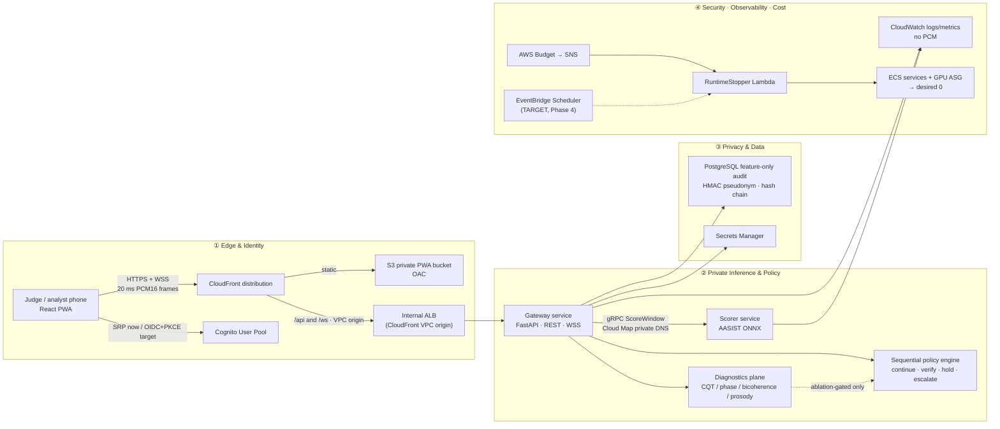

# Architecture — Voice Integrity Control Plane (SIH26104 / PS104)

**Status:** Authoritative system architecture. Supersedes ad-hoc diagrams.
**Companions:** [README.md](README.md) · [prd.md](prd.md) · [technical-design.md](technical-design.md) · [design.md](design.md) · [phases.md](phases.md) · [rules.md](rules.md) · [aws-setup-instructions.md](aws-setup-instructions.md)

> **Normative source added 2026-08-26:** `Part-2(Claude Scoped).pdf` — a repo → GitHub Actions →
> AWS execution plan. It is now the **source** for the CDK stack decomposition (§4.1), the delivery
> plane (§4.3), the ECR repository set, and the repository name `sih26104-voice-integrity`. Those
> four were previously our own decomposition of a gap the earlier documents left open. Where this
> file and that PDF disagree, the disagreement is named in place rather than blended
> ([rules.md](rules.md) R-54).

---

## 1. Architectural style and the one boundary that matters

**Style:** modular, event-aware **microservice control plane** with a deliberately small number
of deployable units. Four units total: `pwa`, `gateway`, `scorer`, `postgres`.

The style is chosen for one reason: to keep the **GPU trust boundary small** without turning a
five-day build into an unfinishable service mesh.

| Unit | Stateful? | Owns | Explicitly does NOT own |
|---|---|---|---|
| **PWA** | no | Consent notice, capture, risk timeline, Privacy Inspector | Any scoring, any policy, any threshold |
| **Gateway** | only the in-memory rolling session | Ingress validation, VAD, session/purpose binding, risk accumulation, policy, audit writes, integration notification | Model loading, GPU, inference |
| **Scorer** | no | Model load, window scoring, calibration application | Sessions, policy, audit, identity, database |
| **PostgreSQL** | yes | Durable **feature-only** audit events, policy versioning | Any audio, transcript, embedding, or direct identifier |

**The detection/decision seam is the architecture.** Scorer emits a number. Gateway decides.
That seam is enforced by the gRPC contract: the Scorer has no access to `purpose_code`,
no access to session history, and no ability to emit an action. It *cannot* decide, by construction.

> Co-locating Gateway and Scorer on one GPU host for the AWS demo is a **capacity choice, not a
> code-level coupling.** At scale, Gateway scales on CPU capacity and Scorer on GPU capacity
> independently; Cloud Map keeps the gRPC endpoint stable across that change.

---

## 2. Four planes

Read the system as four planes. The data path is deliberately narrow.



**Narrowness properties to preserve:**
- The phone speaks **only** HTTPS/WSS to the edge. It never sees Gateway, Scorer, or the DB.
- Gateway sees audio **only transiently**, in process memory.
- Scorer returns **a number**, never a decision.
- The audit system retains a **feature-level** decision record, never audio.
- gRPC never crosses the edge. CloudFront VPC origins do not carry it, and it is not wanted there.

---

## 3. Target vs current: the honest delta

The blueprint diagram contains **target additions not yet in the reference package**. These are
backlog items, not hidden equivalence claims. Presenting any of these as complete is a
disqualifying overclaim (see [rules.md](rules.md) R-01).

| Element | Final target | Current position | Required before "production-ready" |
|---|---|---|---|
| CloudFront → internal ALB | Single public HTTPS/WSS entry via VPC origin | Implemented; **manual** service-managed SG bind, documented in `docs/manifests/cloudfront_sg_bind.md` | Rehearse WSS reconnect + ALB origin health |
| ECS GPU host | One `g4dn.xlarge`, one scorer GPU allocation, app-private subnet | Implemented, runtime-off default | Confirm quota + real image/model start on AWS |
| Diagnostics plane | CQT / phase / bicoherence / prosody as explainability candidates | **Not** policy inputs | Add only after ablation shows robust incremental value. Never hard-code a frequency boundary as spoof evidence |
| Cognito auth | Authorization Code + **PKCE** for a browser client | MVP uses direct SRP via Cognito SDK | Complete PKCE/Hosted UI **or** present SRP truthfully as the controlled demo path |
| Audio capture | Dedicated 16 kHz **AudioWorklet** with backpressure | MVP uses temporary `ScriptProcessor` | Replace before any mobile-reliability claim; test Safari + Android Chromium |
| Nightly stop | `Asia/Kolkata` EventBridge Scheduler → same RuntimeStopper | Budget→SNS→Lambda only | Add scheduler execution role, `cron(...)`, retry/DLQ, enable/disable parameter |
| Service identity | **mTLS** Gateway↔Scorer | VPC isolation + security groups | Implement before any enterprise claim |
| Tenancy | JWT tenant claim, PostgreSQL RLS, tenant-scoped encryption context | Single-tenant schema (`tenant_id` column pre-provisioned) | Implement before any multi-tenant claim |

> **Forward-compatibility decision (ours):** `tenant_id NOT NULL DEFAULT 'demo-tenant'` exists in
> the audit table from Phase 1. Adding the column now costs nothing; adding it in Phase 4 means a
> table rewrite plus a migration of chained hashes. See [technical-design.md](technical-design.md) §5.2.

> **Newly available, deliberately not adopted:** as of ~May 2026 CloudFront added native gRPC and
> native WebSocket-over-VPC-origin support. This changes nothing for Phase 1–3 — internal gRPC
> stays internal either way — and destabilizing a working Day-3 deploy to adopt it mid-sprint is
> a bad trade. Logged as a Phase 4+ design-review spike.

---

## 4. AWS tier (`ap-south-1`)

Runs on a **Paid Plan with verified remaining credits**. This is not a claim that a GPU is free.
The stack starts at **zero** desired ECS tasks and **zero** desired GPU instances. Operators push
images and model artifacts, then explicitly deploy with `deployRuntime=true`.

| Layer | Component | Configuration decision | Why it exists |
|---|---|---|---|
| Edge | CloudFront distribution | S3 default behavior; **non-cached** `/api/*` and `/ws/*`; HTTPS-only viewer policy | One domain, browser-compatible TLS, PWA assets, WSS entry |
| Static client | Private S3 + **Origin Access Control** | Public access blocked; CloudFront principal only | Avoids a public website bucket |
| Ingress | Internal ALB via CloudFront **VPC origin** | TCP 8080 origin; **manual** service-managed SG bind after origin creation | No public ALB, no direct task ingress |
| Gateway | ECS EC2 FastAPI service | 0.5 vCPU, 1 GiB, private subnet, **no** ECS Exec in demo | Validates sessions, frames, policy, audit only |
| Inference | ECS EC2 scorer service | 2 vCPU, 4 GiB, `gpuCount=1`, CUDA ONNX Runtime | Model process separate and GPU-pinned |
| Discovery | AWS Cloud Map private DNS | `scorer.sih26104.local:50051` | No hard-coded IPs in Gateway |
| Data | RDS PostgreSQL 16 `db.t4g.micro` | Private, encrypted, single-AZ, 1-day backup, destroy-on-teardown | Feature-only audit + policy versioning |
| Secrets | Secrets Manager | DB password, ticket key, HMAC key, audit-chain key | No credentials in image or PWA |
| Observability | CloudWatch Logs + metrics | One-week demo retention; **no PCM payload logging** | Operational evidence without audio capture |
| Cost safety | Budget → SNS → Lambda (+ target Scheduler) | Lambda zeroes **both** ECS service counts **and** ASG min/max/desired | A direct EC2 stop is insufficient — the ASG relaunches it |

### 4.1 CDK stack decomposition and deploy order

**Five dependency-ordered stacks, plus one standalone stack — six stack files in
`infra/cdk/lib/`.** The order of the five is forced by cross-stack references (VPC ID, Cloud Map
namespace, secret ARNs); it is not a style preference. `CostSafetyStack` has **no** position in that
dependency chain — it reads nothing from the other five — so its deploy time is a policy decision,
not a technical one.

```
infra/cdk/lib/
  network-stack.ts       NetworkStack    → VPC, private subnets, 1 NAT gateway, deny-by-default SGs
  data-stack.ts          DataStack       → RDS PostgreSQL 16 db.t4g.micro, private, encrypted, single-AZ
  secrets-stack.ts       SecretsStack    → references the Phase-0 Secrets Manager entries by ARN
  compute-stack.ts       ComputeStack    → ECS cluster, GPU ASG (desired=0), Gateway + Scorer task defs, Cloud Map
  edge-stack.ts          EdgeStack       → CloudFront, S3+OAC for PWA, VPC-origin ALB binding
  cost-safety-stack.ts   CostSafetyStack → Budget → SNS → RuntimeStopper Lambda   [STANDALONE — no chain position]
```

Dependency chain (all five, in this order):

```
NetworkStack → DataStack → SecretsStack → ComputeStack → EdgeStack
                                                          └─ LAST: CloudFront takes ~15 min to propagate
```

**Deploy `CostSafetyStack` immediately after `DataStack`** — i.e. interleaved into the chain at
position 3 of 6 even though it depends on nothing. Rationale: the cost-safety plane exists to be
armed *before* anyone can flip `deployRuntime=true`. Deploying it after `ComputeStack` leaves a
window in which GPU capacity is deployable with no budget backstop in place, which inverts the
control ([rules.md](rules.md) R-33). The resulting command sequence is in
[aws-setup-instructions.md](aws-setup-instructions.md) §7 and [phases.md](phases.md) §3.1.

> **⚠️ Reconciled source conflict — needs human confirmation (`H-5`).** The 2026-08-26 PDF is
> internally inconsistent about *when* to deploy `CostSafetyStack`: its file listing says
> "standalone, deploy anytime after data-stack", its prose says "stand up CostSafetyStack
> immediately after DataStack", and its command listing places it after `ComputeStack`. **We took
> the prose reading — immediately after `DataStack`** — because it is the only one of the three that
> preserves the stack's purpose; the other two are permissive about a gap where GPU capacity is
> deployable and unguarded. The file count is six either way. Recorded as open decision `H-5` in
> [prd.md](prd.md) §9.1; a human confirms or overrides before Phase 2 deploys.

### 4.2 Network posture — deny by default

```
Internet ──► CloudFront ──► [CloudFront service-managed SG] ──► Internal ALB :443→:8080
                                                                    │
                                          ALB SG only ──────────────▼
                                                              Gateway :8080
                                                                    │
                                        Gateway SG only ────────────▼
                                                              Scorer :50051 (gRPC)
                                                                    │
                                        Gateway SG only ────────────▼
                                                              RDS :5432
```

- ALB accepts **only** the CloudFront VPC-origin service-managed security group.
- Gateway accepts **only** the ALB SG. Scorer accepts **only** the Gateway SG. RDS accepts
  **only** the Gateway SG.
- The database is not public. **No SSH, no public IP** on the GPU host.
- Local-tier analogue: **only Caddy has published host ports.**

### 4.3 Delivery plane — repo → GitHub Actions → AWS

The repository is `sih26104-voice-integrity`, created **private**. Everything below is part of the
architecture, not "process": the deploy path is the mechanism that makes the cost posture (§7.1) and
the parity claim (§5.1) enforceable rather than verbal.

```
  contributor ──PR──► main (protected)
                        │  required checks: contract-test · secret-scan · privacy-tests
                        │  required: PR + ≥1 review · contracts/ needs 1×Pair B + 1×Pair C
                        ▼
              GitHub Actions, one workflow per service
              gateway-ci.yml · scorer-ci.yml · pwa-ci.yml
                        │  OIDC: sts:AssumeRoleWithWebIdentity
                        │  sub == repo:<org>/sih26104-voice-integrity:*
                        ▼
              gh-actions-deploy-role  (NO AdministratorAccess)
                        │  ECR push · ECS update-service · CloudFormation/CDK
                        │  S3 (CDK assets) · iam:PassRole → named exec roles only
                        │  secretsmanager:GetSecretValue → verification only
                        ▼
              ECR (ap-south-1), three repositories
              sih26104/gateway · sih26104/scorer-gpu · sih26104/scorer-cpu
                        │
                        │  ✋ Phase 1–2: STOPS HERE. Nothing auto-deploys.
                        ▼
              deploy-runtime.yml  ← workflow_dispatch ONLY, + confirm_cost_aware
              stop-runtime.yml    ← run after EVERY session, no exceptions
```

| Decision | Choice | Failure it prevents |
|---|---|---|
| CI → AWS authentication | **OIDC only.** No long-lived access keys, no human user's keys, ever | A leaked key in a fork PR or a laptop backup grants standing AWS access. An OIDC token is minted per run and expires |
| Trust policy scope | `sub` matched to `repo:<org>/sih26104-voice-integrity:*` | An unrelated repository in the same org assuming the deploy role |
| Deploy role permissions | Enumerated actions; **no `AdministratorAccess`**; `iam:PassRole` restricted to the named execution roles | A compromised workflow escalating to account takeover via `PassRole` on `"*"` |
| Workflow granularity | **One workflow per service**, path-filtered on `<service>/**` + `contracts/**` | A PWA change rebuilding and re-pushing the scorer image, invalidating a digest a manifest already recorded |
| Environment promotion | **By image digest, never rebuild** | A rebuild from the same tag produces different bytes. The release manifest ([prd.md](prd.md) §7) names a digest; a rebuild makes that name a lie |
| ECR tag mutability | `IMMUTABLE` | Same as above, enforced by the registry rather than by discipline |
| CDK bootstrap | `cdk bootstrap aws://<account-id>/ap-south-1`, once per account+region | Every `cdk deploy` failing on a missing asset bucket / `cdk-*` execution roles |
| Runtime scaling in CI | Build+push is automatic on `main`; **scaling is not** | A routine `git push` starting GPU spend ([rules.md](rules.md) R-29) |

**Why three ECR repositories and not two.** `sih26104/scorer-cpu` exists because the local CPU
fallback tier needs its own image: one installs `onnxruntime`, the other `onnxruntime-gpu`, so the
two cannot be byte-identical. That is not a parity failure — it is the documented parity exception in
§5.1 and [rules.md](rules.md) R-06. Giving the CPU tier its own repository makes the exception
visible in the registry instead of hidden behind a tag convention.

**Branch protection is a Phase 0 task, not a Phase 4 cleanup.** Require a PR, require ≥1 review, and
require the `contract-test` and `secret-scan` checks. Retrofitting protection after three pairs have
pushed directly to `main` means rewriting history or accepting an unreviewed contract change in the
seam all three pairs integrate against.

---

## 5. CPU-only local fallback tier

A **single-host Compose shell**, not a second product. Built **Day 1, in parallel** with the AWS
bootstrap — it is the integration harness Pairs B and C use while Pair A provisions AWS.

```
Host :443 ──► Caddy (local trusted TLS via mkcert)
                ├── /            → static PWA build
                ├── /api/*       → gateway:8080
                └── /ws/*        → gateway:8080  (WebSocket upgrade)
Compose DNS only (no published ports):
   gateway:8080 ──gRPC──► scorer:50051
   gateway:8080 ──TCP───► db:5432 (named volume pgdata)
   gateway:8080 ──JWKS──► testidp:8081   [DEMO-ONLY, refuses aws-gpu profile]
```

**Caddy caveat that must be rehearsed:** Caddy upgrades HTTP to a bidirectional WebSocket tunnel,
but it **closes open WebSockets on configuration reload**. Never reload Caddy during a judge
stream, and test client reconnect/backoff explicitly.

### 5.1 The parity invariant — what must be identical, and what cannot be

CPU and GPU images **cannot be byte-identical**: one contains `onnxruntime`, the other
`onnxruntime-gpu`. Claiming otherwise is one of the four corrections `research-evidence.md`
requires. The invariant is instead this exact set:

| Must be identical (the parity set) | May differ (deployment configuration) |
|---|---|
| Git commit | Base image / ORT package |
| Gateway + Scorer application source | ONNX execution provider |
| Protobuf contract hash | Trust root (ACM vs mkcert) |
| OpenAPI schema hash | Identity issuer (Cognito vs local JWKS) |
| Migration set | Storage backing (RDS vs named volume) |
| Policy bundle hash | Secret transport (Secrets Manager vs Docker secret) |
| Model ONNX SHA-256 | Reachability (CloudFront vs LAN) |
| Calibration SHA-256 | |
| Contract-test suite | |

**Both tiers must print the entire parity set in the startup banner and stamp it into audit
metadata.** That is what makes the Day-5 dual-tier claim checkable rather than asserted.

| Concern | AWS tier | CPU fallback | Invariant judges should see |
|---|---|---|---|
| Browser edge | CloudFront + private S3 | Caddy + local static PWA | Same PWA build hash; only API base URL differs |
| Identity | Cognito | Restricted local JWKS test issuer | Same JWT validation code + group/tenant claim contract; local issuer is **explicitly demo-only** |
| Gateway | ECS container | Same image/application source | Same OpenAPI + WebSocket contract |
| Scorer | CUDA ORT on `g4dn.xlarge` | CPU ORT after p95 thread sweep | Same model + calibration hashes; provider differs |
| Audit | RDS PostgreSQL | Named-volume Postgres container | Same schema, verifier, retention worker |
| Secrets | Secrets Manager injection | Docker secrets / protected `.env` | Same logical key names; **no secrets in Git** |
| Reachability | Internet via CloudFront | Venue LAN first; tunnel only if rehearsed | Same consent notice; **a tunnel is not "offline"** |

---

## 6. Technology stack (pinned)

Pins are from blueprint §5. Unpinned production rebuilds are prohibited ([rules.md](rules.md) R-11).

| Concern | Choice | Pin |
|---|---|---|
| PWA | React / React DOM / Vite | `19.2.8` / `19.2.8` / `8.2.2`, `pnpm-lock.yaml` committed |
| Cognito client | `amazon-cognito-identity-js` | `6.3.20` — direct SRP for MVP; PKCE is the production target |
| Styling | Plain CSS, accessible native controls | no design-system dependency |
| Gateway runtime | Python / FastAPI / Uvicorn / Pydantic Settings | `3.12` / `0.115.6` / `0.34.0` / `2.7.1` |
| Streaming/audio | `webrtcvad-wheels` / NumPy | `2.0.14` / `2.1.3`; AudioWorklet is the capture target |
| Internal RPC | `grpcio` / `grpcio-tools` | `1.68.1`; protobuf compatibility test on every change |
| DB | PostgreSQL / `asyncpg` | `16` / `0.30.0`; **Alembic** for versioned migrations |
| ML training | PyTorch matching AASIST reference, torchaudio; librosa **offline diagnostics only** | locked `uv`/conda env + CUDA version |
| ML serving | AWS `onnxruntime-gpu` `1.20.1`; local `onnxruntime` CPU | pin CUDA/cuDNN/ORT + model hash |
| Edge/local proxy | Caddy 2 + mkcert | pin Caddy image **digest** |
| IaC | AWS CDK TypeScript | `2.266.0`; synth + policy scan before deploy |
| Observability | CloudWatch structured logs | OpenTelemetry is a target; metric schema versioned in code |

> ⚠️ **Local environment gap:** this workstation has **Python 3.14.5**, but the stack pins
> **3.12**. `webrtcvad-wheels` and `onnxruntime` wheel availability for 3.14 is not guaranteed.
> Use a 3.12 interpreter locally (`uv python install 3.12`); containers pin `python:3.12-slim`.
> Recorded in [memory.md](memory.md) as an active environment constraint.

---

## 7. Scalability, reliability, cost

The five-day configuration prioritizes **reliable demonstration over artificial scale**.

- One GPU scorer serializes or bounds concurrent score work.
- Gateway exposes backpressure and **refuses a new high-risk stream rather than queue unbounded
  audio**. This is a privacy control as much as a performance one: queued audio is retained audio.
- Production profile (later): CPU Gateway capacity separate from GPU Scorer capacity, idempotent
  audit writes, retries only for safe webhooks, two AZs, RDS Multi-AZ + PITR, dead-letter path for
  non-sensitive integration events.

### 7.1 Four-layer cost plane (three live, one target)

1. **Runtime is zero by default.** Nothing runs unless someone explicitly turns it on. The only path
   that starts GPU spend is `deploy-runtime.yml` via `workflow_dispatch` with an explicit
   `confirm_cost_aware` input — CI's automatic path stops at an ECR push (§4.3).
2. **Manual `stop-runtime` after every session, without exception.** This is the *primary* control,
   and it is a human action on a checklist, not an automation.
3. **Budget → SNS → RuntimeStopper.** Both actual and forecast thresholds publish to SNS; the
   Lambda zeroes ECS service counts **and** ASG min/max/desired.
4. **Target: EventBridge Scheduler** invokes the same Lambda nightly in `Asia/Kolkata`. Scheduler
   is timezone-aware with 60-second precision — sufficient for a cost stop, **not** a real-time
   safety control.

**State the actual latency characteristic, not a circuit-breaker metaphor.** AWS Budgets evaluate
against Cost Explorer data, which lags: cost and usage data refreshes at most a few times a day, and
a budget alert therefore fires **hours** after the spend that triggered it — by which time a GPU left
running overnight has already billed for those hours. Layer 3 is a *delayed* cost control whose job is
to bound the damage when a human forgets layer 2. It is not, and must not be described as, an
instantaneous circuit breaker. On a slide, layer 2 is the mechanism and layer 3 is the backstop
([rules.md](rules.md) R-30).

---

## 8. Observability

| Signal | Name | Notes |
|---|---|---|
| Latency | `voice_first_decision_latency_ms`, `scorer_latency_ms` | p50/p95, tagged by `deployment_profile` |
| Queue | `scorer_queue_depth`, `stream_rejected_backpressure_total` | bounded worker pool |
| Session | `stream_reconnect_total`, `gateway_healthy` | reconnect rehearsal evidence |
| Privacy | `raw_audio_persisted_bytes` (must be 0), `retention_delete_total` | asserted in CI, not just monitored |
| Cost | `gpu_runtime_minutes`, `runtime_stop_total` | judge-facing cost story |
| Integrity | `audit_hash_verification_failures` (must be 0) | verifier run is part of the demo |

Structured logs are **redacted at the logger**, not at review time. No PCM, transcript, phone
number, raw caller name, or embedding may appear in any log attribute. The metric schema is
versioned in code.

---

## 9. Top technical risks

| Risk | Why material | Mitigation / decision |
|---|---|---|
| **OOD synthetic speech + codec shift** | ASVspoof performance cannot guarantee Indian languages, accents, mobile mics, VoIP codecs, or new generators | Separate benchmark metrics from generator/language/codec-disjoint local holdouts; use `uncertain` + secondary verification; monitor cohort performance |
| **CPU fallback misses timing** | Local tier may be an integrated-GPU laptop on CPU-only inference | Benchmark the *exact* laptop/model/window contract; sweep ORT threads; quantize only after parity/calibration/EER gates; a pre-recorded fallback demo is permitted **only** if labelled honestly |
| **GPU cost/availability failure** | Quota, capacity, image/model error, or budget delay can break the AWS demo | Local fallback from Day 1; package images/model offline (`docker save`); test AWS→local switch on Day 5; budget + scheduler **and** manual stop |
| **Privacy drift** | Debug logging or convenient capture turns a demo into unconsented voice retention | Schema deny-list, log-redaction tests, explicit consent, HMAC references, retention worker, no default cross-session feature |
| **Model overclaim** | Judges may infer a detector score proves fraud | Demonstrate a *simulated prevention-control* outcome; present failure modes and uncertainty; never claim real fraud reduction without a pilot |

### 9.1 The decisive trade-off

> **Scope over faux completeness.** Two focused services, one primary AASIST-family model,
> calibrated temporal policy, and a privacy-visible demo are stronger than an unvalidated
> ensemble, a carrier integration, or a generic "AI dashboard."

The AWS tier demonstrates cloud integration. The local tier demonstrates resilience and edge
capability. The model playbook governs whether any score deserves to influence a policy at all.

---

## 10. Architecture governance

Work follows a strict sequence, and it is not negotiable by convenience:

1. **Contract and privacy boundary first**
2. **Benchmark and calibration second**
3. **Realtime policy and mobile flow third**
4. **Dual-tier rehearsals and presentation evidence last**

> No diagnostic feature, cross-session identity function, or visual dashboard feature may become
> a primary decision input before the core score, calibration, and policy control loop pass
> their acceptance gates.

Every release carries the manifest defined in [prd.md](prd.md) §7. A release without it is not
judge-ready and not reproducible.
